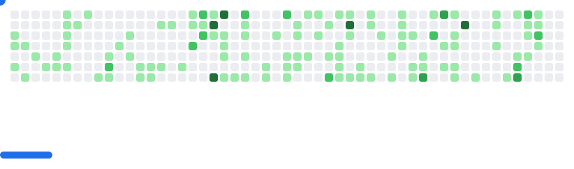

<h3 align="center"> 👨‍💻 Whoami</h3>

  <samp>PowerShell enthusiast, part-time pilgrim and hiking addicted.</samp>

----

<h3 align="center"> Tools</h3>

  
  
  
  
  
  
  

  

----

<picture align="center">
  <source
    media="(prefers-color-scheme: dark)"
    srcset="images/breakout-dark.svg"
  />
  <source
    media="(prefers-color-scheme: light)"
    srcset="images/breakout-light.svg"
  />
  
</picture>
